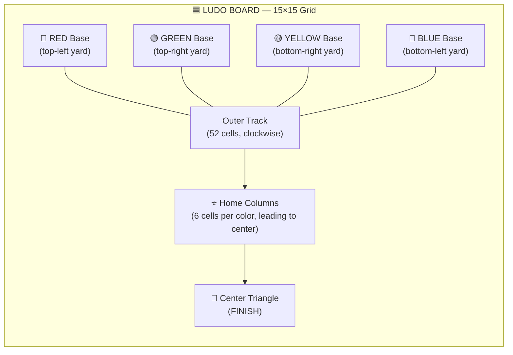
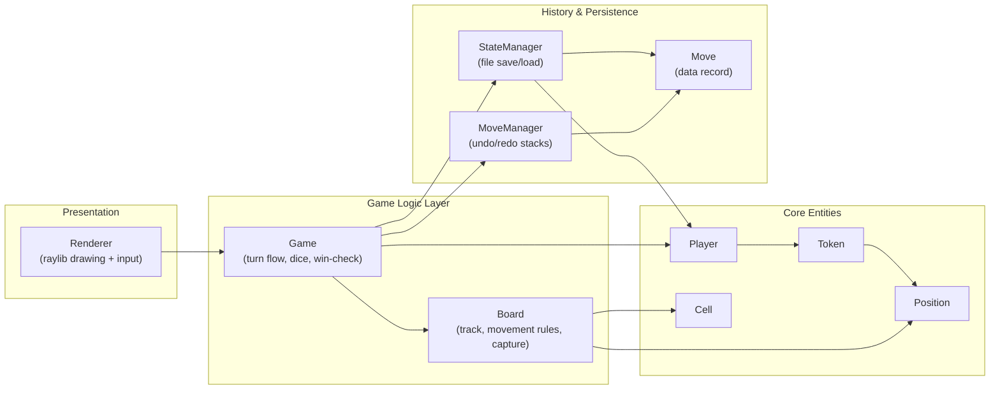
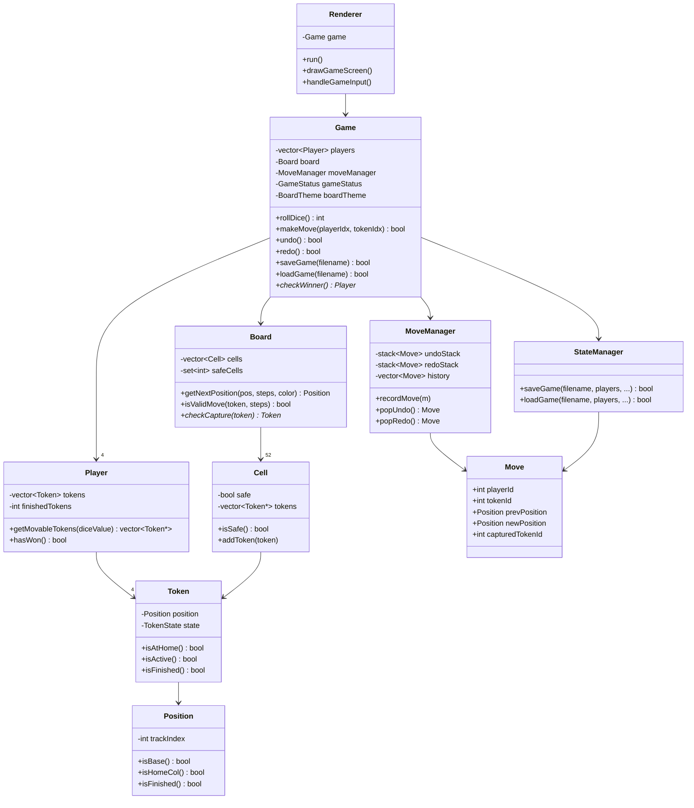

# 🎲 LUDO — C++ Desktop Edition

<div align="center">

**A fully playable 2–4 player Ludo board game, built from scratch in modern C++ with the [raylib](https://www.raylib.com/) graphics library.**


</div>

---

## 📖 Table of Contents

1. [What is this?](#-what-is-this)
2. [Feature Overview](#-feature-overview)
3. [Board & Token Visualization](#-board--token-visualization)
4. [How to Play](#-how-to-play)
5. [Controls Cheat-Sheet](#-controls-cheat-sheet)
6. [Project Architecture](#-project-architecture)
7. [Class Diagram](#-class-diagram)
8. [Core CS Concepts Used](#-core-cs-concepts-used)
9. [File Structure](#-file-structure)
10. [Build & Run Instructions](#-build--run-instructions)
11. [Save / Load Format](#-save--load-format)
13. [Possible Future Improvements](#-possible-future-improvements)

---

## 🎯 What is this?

This is a complete, object-oriented implementation of the classic board game **Ludo**, written entirely in **C++** and rendered with **raylib**. It is not just a console simulation — it has a real graphical menu, animated dice, a themeable board, undo/redo, save/load, and a full move-replay system.

It was built (and later debugged/fixed) as an academic systems-design project, demonstrating clean separation between **game logic**, **game state**, and **rendering** — similar to an MVC pattern.

---

## ✨ Feature Overview

| Category | Feature |
|---|---|
| 🎮 Gameplay | 2 to 4 human players, classic Ludo rules, capturing, safe squares, home column |
| 🎲 Dice | Animated dice roll, "roll again on 6" rule, 3-consecutive-sixes forfeit |
| 🖱️ Interaction | Click-to-roll, click-to-move, highlighted legal moves & destination preview |
| 🎨 Themes | 3 selectable board themes — **Classic**, **Dark**, **Pastel** |
| ↩️ Undo / Redo | Full move history with stack-based undo & redo |
| 💾 Save / Load | Save the entire game state to a text file and reload it later |
| 🔁 Replay Mode | Step forward/backward through the complete move history of a finished game |
| 👤 Custom Names | Editable player names on the setup screen |
| 🏆 Win Detection | Automatic winner detection once all 4 tokens of a player finish |

---

## 🗺️ Board & Token Visualization

The board is a classic 15×15 Ludo cross with a 52-cell outer track, 4 colored home columns, and 4 colored base "yards."



**Track anatomy (per `Position.h` / `Board.cpp`):**

| Zone | Internal value | Meaning |
|---|---|---|
| Base | `trackIndex == -1` | Token sitting in its starting yard |
| Main Track | `0 – 51` | Shared 52-square outer ring (entered on a roll of 6) |
| Home Column | `100 – 105` | Color-exclusive final stretch (6 steps) |
| Finished | `999` | Token has safely reached the center |

**Safe squares** (no captures allowed) sit at global track indices:
`{0, 8, 13, 21, 26, 34, 39, 47}` — one of which is always a player's own entry square.

Each color enters the main track at a different offset:

| Color | Entry Square |
|---|---|
| 🔵 Blue | 0 |
| 🔴 Red | 13 |
| 🟢 Green | 26 |
| 🟡 Yellow | 39 |

---

## 🕹️ How to Play

1. **Launch the game** → you land on the **Main Menu** with three options: *New Game*, *Load Game*, *Quit*.
2. **Choose 2–4 players**, type custom names, and pick a **board theme** (Classic / Dark / Pastel).
3. Press **START** to enter the game screen.
4. Each turn:
   - The **current player's name is highlighted** in the side panel.
   - **Roll the dice** (click the dice icon or press `SPACE`).
   - Any token that can legally move is **highlighted yellow** on the board.
   - **Click a highlighted token** to move it by the rolled number.
5. **Ludo Rules enforced by the engine:**
   - A token leaves its base **only on a roll of 6**.
   - Rolling a **6 grants an extra turn**.
   - Rolling **three 6's in a row forfeits the turn** automatically.
   - Landing on an opponent's token on a **non-safe square captures it**, sending it back to base.
   - Tokens are **safe** on starred squares — no captures can happen there.
   - A token must travel exactly through its **own home column** to reach the center.
   - A player **wins** once all 4 of their tokens reach the finish (center).
6. When a player wins, the **Game Over screen** appears — you can immediately **replay** the whole match move-by-move or return to the menu.

### 🧮 Turn Logic — How a Turn Actually Works (Pseudocode)

This is the real turn-loop logic from `Game.cpp`, simplified into readable pseudocode so you can see exactly what happens behind the scenes every turn:

```cpp
while (!gameOver) {

    player = players[currentPlayerIndex];

    // 1) Roll the dice
    roll = rollDice();                         // random 1–6

    if (roll == 6) consecutiveSixes++;
    else            consecutiveSixes = 0;

    // 2) Three 6's in a row → forfeit the turn
    if (consecutiveSixes == 3) {
        consecutiveSixes = 0;
        nextTurn();
        continue;
    }

    // 3) Find every token this player is allowed to move
    movableTokens = getMovableTokens(player, roll);

    // 4) No legal move? → automatically pass
    if (movableTokens.isEmpty()) {
        nextTurn();
        continue;
    }

    // 5) Wait for the player to click a highlighted token
    chosenToken = waitForPlayerClick(movableTokens);

    // 6) Apply the move
    newPos = board.getNextPosition(chosenToken.position, roll, player.color);
    moveToken(chosenToken, newPos);

    // 7) Capture check — landing on an opponent (non-safe square) sends it home
    if (board.checkCapture(chosenToken))
        sendCapturedTokenToBase();

    // 8) Token reached the center?
    if (newPos.isFinished())
        player.finishedTokens++;

    // 9) Win check
    if (player.finishedTokens == 4) {
        announceWinner(player);
        break;
    }

    // 10) Rolling a 6 = bonus turn, otherwise pass to next player
    if (roll != 6)
        nextTurn();
}
```

**Key takeaway:** every rule in the game — base-exit on 6, bonus turns, three-sixes forfeit, captures, safe squares, and winning — boils down to that one loop, repeated every turn. `Game::rollDice()`, `Game::makeMove()`, and `Game::nextTurn()` in the real source are the actual implementations of steps 1, 5–9, and 10 above.

---

## ⌨️ Controls Cheat-Sheet

| Screen | Input | Action |
|---|---|---|
| Main Menu | `Mouse Click` | Select New Game / Load Game / Quit |
| Main Menu | `ESC` | Quit the application |
| Name/Setup Screen | `Click` field | Select a player-name text box |
| Name/Setup Screen | *Type* | Enter player name (max 15 chars) |
| Name/Setup Screen | `Enter` / `Tab` | Move to next name field |
| Name/Setup Screen | `Click` theme swatch | Choose Classic / Dark / Pastel theme |
| Name/Setup Screen | `ESC` | Back to Main Menu |
| **In-Game** | `SPACE` or click dice | Roll the dice |
| **In-Game** | `Click` a glowing token | Move that token |
| **In-Game** | `U` | **Undo** last move |
| **In-Game** | `R` | **Redo** last undone move |
| **In-Game** | `S` | **Save** game → `ludo_save.txt` |
| **In-Game** | `L` | **Load** game from `ludo_save.txt` |
| **In-Game** | `P` | Start **Replay** mode |
| **In-Game** | `ESC` | Return to Main Menu |
| **Replay Mode** | `→` (Right Arrow) | Step forward one move |
| **Replay Mode** | `←` (Left Arrow) | Step backward one move |
| **Replay Mode** | `ESC` | Exit replay |

---

## 🏗️ Project Architecture

The codebase follows a layered design that cleanly separates **data**, **rules**, **history**, **persistence**, and **presentation**:



**Layer responsibilities:**

- **`Renderer`** — owns the raylib window, draws every screen (menu, setup, game, replay, game-over), and converts mouse/keyboard input into `Game` method calls. It never touches game rules directly.
- **`Game`** — the central orchestrator: dice rolling, turn order, applying/reversing moves, win detection, theme state, and wiring `MoveManager` + `StateManager`.
- **`Board`** — the rulebook: computes the next `Position` for a move, validates whether a move is legal, and detects captures. Owns the 52 `Cell` objects.
- **`Player` / `Token`** — the data entities: 4 tokens per player, each with a `TokenState` (`BASE`, `ACTIVE`, `FINISHED`) and a `Position`.
- **`Cell`** — a single square on the main track; tracks which tokens currently occupy it and whether it's a safe square.
- **`Move` / `MoveManager`** — every move is captured as an immutable `Move` record (who, what, dice value, before/after position, anything captured). `MoveManager` keeps an **undo stack**, a **redo stack**, and a flat **history vector** used for replay.
- **`StateManager`** — serializes/deserializes the entire game (players, tokens, move history) to a plain-text save file.

---

## 🧩 Class Diagram



---

## 🧠 Core CS Concepts Used

This project is a great showcase of **object-oriented design** and core data-structure usage in real C++:

| Concept | Where it's used |
|---|---|
| **Encapsulation** | Every class (`Token`, `Player`, `Cell`, `Board`) hides its state behind private fields with public getters/setters |
| **Single Responsibility Principle** | `Board` only knows movement rules, `Renderer` only knows drawing, `StateManager` only knows file I/O |
| **Enums (`enum class`)** | `TokenState`, `PlayerColor`, `GameStatus`, `BoardTheme` — type-safe state machines |
| **Command Pattern (Undo/Redo)** | Every move is captured as a `Move` struct and pushed onto a `std::stack` — classic command-pattern undo/redo |
| **Stacks (`std::stack`)** | `MoveManager::undoStack` and `redoStack` |
| **Vectors (`std::vector`)** | Players, tokens, cells, move history, movable-token lists |
| **Sets (`std::set`)** | `Board::safeCells` for O(log n) safe-square lookup |
| **Modular Arithmetic** | `Board::getNextPosition()` uses `% 52` to wrap tokens around the shared outer track |
| **File I/O / Serialization** | `StateManager` reads/writes a custom plain-text save format with `ifstream` / `ofstream` |
| **Operator Overloading** | `Position::operator==` / `operator!=` for clean position comparisons |
| **Pointers & Aggregation** | `Cell` stores `Token*` (raw pointers) rather than owning tokens, since `Player` owns the actual `Token` objects |
| **State Machines** | `GameStatus` drives which screen is drawn/updated (`MENU → NAME_INPUT → PLAYING → GAME_OVER ⇄ REPLAY`) |
| **Separation of Concerns (MVC-style)** | `Game`+`Board` = Model, `Renderer` = View + Controller |
| **Immediate-mode GUI rendering** | The entire UI (buttons, text fields, dice, board) is hand-drawn every frame with raylib primitives — no separate UI library |

---

## 🗂️ File Structure

```
LUDO_FIXED/
├── main.cpp              # Entry point — creates Game + Renderer, runs the loop
├── Game.h / Game.cpp      # Core game orchestration: turns, dice, win check, theme
├── Board.h / Board.cpp    # Track layout, movement math, validity & capture rules
├── Cell.h / Cell.cpp      # A single track square (occupancy + safe flag)
├── Player.h / Player.cpp  # A player and their 4 tokens
├── Token.h / Token.cpp    # A single playing piece (position + state)
├── Position.h             # Lightweight value type for "where on the board"
├── Move.h / Move.cpp      # Immutable record of a single move (for undo/replay)
├── MoveManager.h / .cpp   # Undo / redo stacks + full move history
├── StateManager.h / .cpp  # Save-to-file / load-from-file logic
├── Renderer.h / Renderer.cpp  # raylib drawing + input handling (all 5 screens)
```

---

## ⚙️ Build & Run Instructions

This project depends only on **[raylib](https://www.raylib.com/)** (a lightweight C graphics library) and a C++17-capable compiler.

### 1. Install raylib

| Platform | Command |
|---|---|
| **Windows (vcpkg)** | `vcpkg install raylib` |
| **macOS (Homebrew)** | `brew install raylib` |
| **Linux (apt, Debian/Ubuntu)** | `sudo apt install libraylib-dev` |
| **From source** | See the official guide: <https://github.com/raysan5/raylib/wiki> |

### 2. Compile

From inside the `LUDO_FIXED/` folder:

```bash
# Linux / macOS
g++ -std=c++17 *.cpp -o ludo -lraylib -lGL -lm -lpthread -ldl -lrt -lX11

# macOS (Homebrew raylib)
g++ -std=c++17 *.cpp -o ludo -lraylib -framework OpenGL -framework Cocoa -framework IOKit

# Windows (MinGW)
g++ -std=c++17 *.cpp -o ludo.exe -lraylib -lopengl32 -lgdi32 -lwinmm
```

> 💡 **Tip:** If you use Visual Studio, create a new empty C++ project, add all `.h`/`.cpp` files, link `raylib.lib`, and set the subsystem to Console or Windows as preferred.

### 3. Run

```bash
./ludo        # Linux/macOS
ludo.exe      # Windows
```

---

## 💾 Save / Load Format

Pressing **`S`** writes the entire game state to `ludo_save.txt` in a simple, human-readable text format (`LUDO_SAVE_V2`):

```
LUDO_SAVE_V2
numPlayers 4
currentPlayerIndex 1
diceLastRoll 6
consecutiveSixes 1
PLAYERS
player 0 Red 0 1
  token 0 1 5
  token 1 2 999
  token 2 0 -1
  token 3 0 -1
...
HISTORY
move 0 0 6 -1 13 -1 -1 -1 0
...
END
```

- `PLAYERS` block: one line per player (`id, name, color, finishedCount`), followed by 4 token lines (`id, state, trackIndex`).
- `HISTORY` block: every move ever made, used to fully reconstruct **undo/redo** and **replay** after loading.
- The loader also supports an older `LUDO_SAVE_V1` format for backward compatibility.

---


## 🚀 Possible Future Improvements

- 🤖 AI/computer-controlled opponents
- 🌐 Online multiplayer over sockets
- 🔊 Sound effects for dice rolls and captures
- 📱 Responsive layout for different window sizes
- 🧪 Unit tests for `Board::getNextPosition()` and capture logic

---

<div align="center">

Made with ❤️, C++17, and raylib.

</div>
